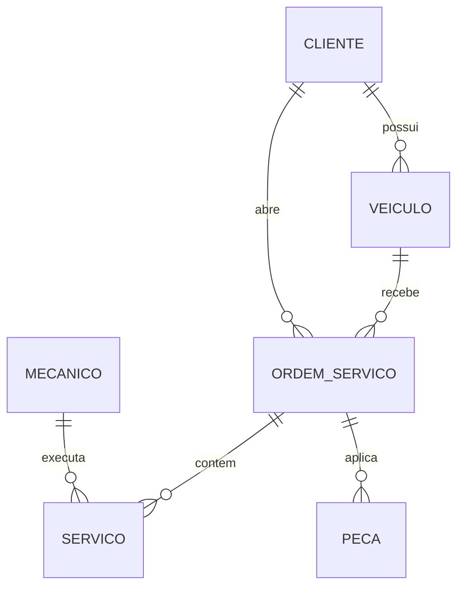

# CarRepair

Sistema acadêmico para gestão de oficina mecânica, desenvolvido com **Angular 21**, **TypeScript** e modelagem relacional em **PostgreSQL**, com foco em organização didática, separação por domínios e preparação para apresentação técnica em sala de aula.

**Objetivo desta documentação:** Refletir o estado atual do projeto, padronizar a nomenclatura para CarRepair, e consolidar uma visão clara da arquitetura, domínio, banco de dados, fluxos, extensibilidade e operação do sistema.

---

## 1. Visão Executiva
O CarRepair é uma aplicação de apoio à operação de uma oficina mecânica. O sistema organiza o cadastro e a consulta dos principais elementos do domínio:

- **Usuários:** Que operam o sistema.
- **Clientes:** Atendidos pela oficina.
- **Veículos:** Vinculados aos clientes.
- **Mecânicos:** Responsáveis pela execução técnica.
- **Ordens de Serviço (OS):** Que centralizam atendimento, diagnóstico, serviços executados e peças aplicadas.

No frontend, a aplicação foi estruturada em páginas standalone e serviços por domínio. A comunicação com a API é centralizada por uma camada HTTP base, e os erros são tratados por um interceptor global, responsável por transformar falhas técnicas em mensagens amigáveis para o usuário.

---

## 2. Objetivo e Aplicação do Projeto

### 2.1 Objetivo Acadêmico
O projeto foi construído para demonstrar, em um cenário realista e didático:
- Modelagem de domínio.
- Organização de frontend Angular por responsabilidades.
- Consumo de API REST.
- Tratamento centralizado de erros.
- Separação entre modelos, páginas, serviços e utilitários.
- Mapeamento entre entidades de negócio e estrutura relacional.

### 2.2 Aplicação Prática
Em um contexto de oficina mecânica, o sistema permite representar o ciclo principal de atendimento:
1. Cadastrar um cliente.
2. Associar um ou mais veículos ao cliente.
3. Cadastrar mecânicos e operadores do sistema.
4. Abrir uma ordem de serviço para um veículo.
5. Registrar os serviços executados e peças aplicadas.
6. Acompanhar o status da ordem até a finalização.

---

## 3. Estado Atual do Projeto
Atualmente, o projeto está organizado para operar com uma API configurada via ambiente:
- **apiBaseUrl:** `http://localhost:9081` (ajustado conforme configuração atual)
- Os serviços de domínio consomem endpoints REST.
- A camada HTTP comum é fornecida por `ApiService`.
- Falhas de requisição são tratadas de forma centralizada.

> [!IMPORTANT]
> **Diretriz Arquitetural:** O frontend deve consumir a API real. Falhas de integração não devem disparar dados simulados; erros devem ser capturados e apresentados ao usuário via interface amigável.

---

## 4. Stack Tecnológica

### 4.1 Frontend
- **Angular 21**
- **TypeScript 6.0.x**
- **TailwindCSS 4.0**
- **RxJS 7.8.x**

### 4.2 Build e Ferramentas
- **Angular CLI 21**
- **@angular/build** (Application Builder)
- **Vitest** (Testes Unitários)
- **Prettier** (Formatação)

### 4.3 Banco de Dados
- **PostgreSQL** (com extensões `pgcrypto`, `UUID`, e tipos `ENUM`).

---

## 5. Estrutura do Projeto

```text
.
├── src/
│   ├── app/
│   │   ├── core/           # Infraestrutura (http, services base)
│   │   ├── features/       # Módulos de negócio (Dashboard, Clientes, etc.)
│   │   ├── models/         # Interfaces TypeScript (Domínio)
│   │   ├── shared/         # Componentes e pipes reutilizáveis
│   │   ├── app.config.ts   # Configuração da aplicação
│   │   ├── app.routes.ts   # Mapeamento de rotas
│   │   └── app.ts          # Componente raiz
│   └── environments/       # Configurações por ambiente
├── angular.json
├── package.json
└── README.md
```

---

## 6. Mapeamento de Rotas

As rotas atuais da aplicação são gerenciadas via *Lazy Loading*:

```mermaid
graph LR
    Root[/] --> Dash[Dashboard]
    Root --> Cli[Clientes]
    Root --> Vei[Veículos]
    Root --> Mec[Mecânicos]
    Root --> OS[Ordens de Serviço]
    Root --> Serv[Serviços]
```

---

## 7. Domínios do Negócio

### 7.1 Cliente
Representa o proprietário ou responsável pelo veículo.
- `id`, `nome`, `cpf`, `telefone`, `endereco`, `cidade`, etc.

### 7.2 Veículo
Representa o bem atendido pela oficina.
- `id`, `clienteId`, `placa`, `marca`, `modelo`, `ano`.

### 7.3 Mecânico
Representa o profissional técnico responsável pela execução.
- `id`, `nome`, `especialidade`, `telefone`, `ativo`.

### 7.4 Ordem de Serviço
Entidade central que vincula todos os domínios.
- `status`: `aberta`, `em_execucao`, `finalizada`, `cancelada`.

---

## 8. DER - Diagrama Entidade Relacionamento



---

## 9. Como Executar o Projeto

### 9.1 Instalação
```bash
npm install
```

### 9.2 Execução (Desenvolvimento)
```bash
npm start
```
O sistema estará disponível em: `http://localhost:4200`

### 9.3 Testes
```bash
npm test
```

---

## 10. Conclusão
O **CarRepair** é uma base acadêmica consistente para demonstrar como estruturar uma aplicação web de oficina mecânica com frontend Angular e persistência relacional. A solução evidencia conceitos de organização por domínio, separação de responsabilidades e tratamento de erros, sendo ideal para apresentações técnicas e evolução contínua.
