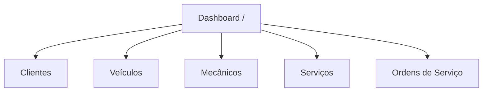
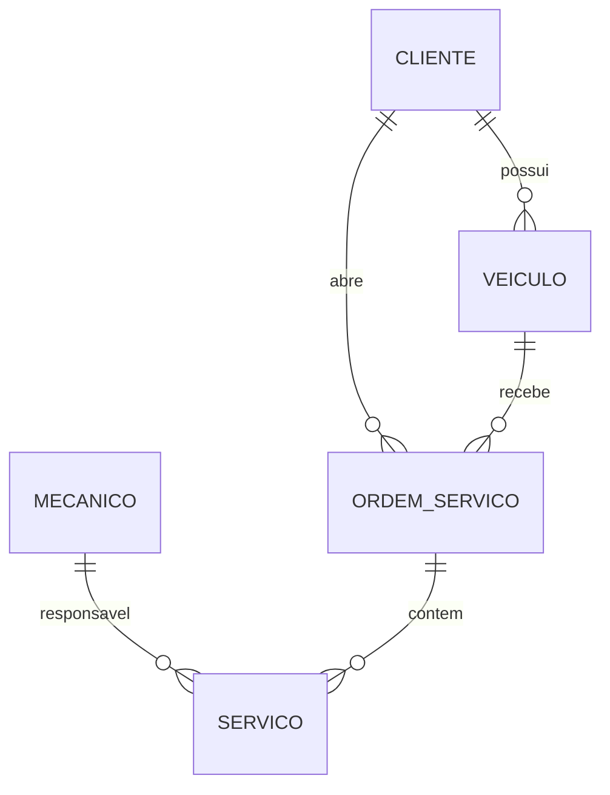

# CarRepair

Sistema acadêmico para gestão de oficina mecânica, desenvolvido com **Angular 21**, **TypeScript** e modelagem relacional em **PostgreSQL**, com foco em organização didática, separação por domínios e preparação para apresentação técnica em sala de aula.

**Objetivo desta documentação:** Refletir o estado atual do projeto, padronizar a nomenclatura para **CarRepair**, e consolidar uma visão clara da arquitetura, domínio, banco de dados, fluxos, extensibilidade e operação do sistema.

---

## 1. Visão Executiva
O CarRepair é uma aplicação de apoio à operação de uma oficina mecânica. O sistema organiza o cadastro e a consulta dos principais elementos do domínio:

- **Usuários:** Que operam o sistema.
- **Clientes:** Atendidos pela oficina.
- **Veículos:** Vinculados aos clientes.
- **Mecânicos:** Responsáveis pela execução técnica.
- **Ordens de Serviço (OS):** Centralizam atendimento, diagnóstico e serviços.

No frontend, a aplicação utiliza componentes **standalone** e serviços por domínio. A comunicação com a API é centralizada em uma camada HTTP base (`ApiService`), com tratamento global de erros.

---

## 2. Objetivo e Aplicação do Projeto

### 2.1 Objetivo Acadêmico
Demonstrar na prática:
- Modelagem de domínio e arquitetura em camadas.
- Frontend moderno com Angular 21 e Signals.
- Consumo de API REST e tratamento centralizado de erros.
- Mapeamento entre entidades de negócio e estrutura relacional.

### 2.2 Aplicação Prática
Permite o ciclo completo de atendimento:
1. Cadastro de Clientes e Veículos.
2. Gestão de Mecânicos e Especialidades.
3. Abertura de OS associando Veículo, Cliente e Mecânico.
4. Registro de serviços executados e acompanhamento de status.

---

## 3. Estado Atual do Projeto
- **API Base:** `http://localhost:9081` (Backend Spring Boot).
- **Frontend:** `http://localhost:4200` (Angular 21).
- **Resiliência:** Dashboard carrega estatísticas em tempo real com tratamento individual de falhas.
- **Documentação:** README consolidado para apresentação técnica.

---

## 4. Stack Tecnológica
- **Frontend:** Angular 21, TypeScript 6.0, TailwindCSS 4.0, RxJS 7.8.
- **Ferramentas:** Angular CLI 21, Vitest (Testes), Prettier (Estilo).
- **Banco de Dados:** PostgreSQL (UUID, ENUMs, pgcrypto).

---

## 5. Estrutura do Projeto (Frontend)

```text
.
├── src/
│   ├── app/
│   │   ├── core/           # Serviços base (HTTP, API)
│   │   ├── features/       # Módulos: dashboard, clientes, veiculos, mecanico, servicos, ordem-servico
│   │   ├── models/         # Interfaces de domínio (Interfaces TS)
│   │   ├── shared/         # Componentes, diretivas e pipes comuns
│   │   ├── app.routes.ts   # Configuração de rotas (Lazy Loading)
│   │   └── app.ts          # Componente raiz
│   └── environments/       # Configurações de API por ambiente
```

---

## 6. Mapeamento de Rotas



---

## 7. Domínios do Negócio

### 7.1 Cliente
- **Campos:** `id`, `nome`, `cpf`, `telefone`, `endereco`, `cidade`.
- **Regra:** Um cliente pode ter múltiplos veículos.

### 7.2 Veículo
- **Campos:** `id`, `clienteId`, `placa`, `marca`, `modelo`, `ano`.
- **Regra:** Identifica o automóvel atendido na OS.

### 7.3 Mecânico
- **Campos:** `id`, `nome`, `especialidade`, `telefone`.
- **Regra:** Profissional técnico vinculado aos serviços executados.

### 7.4 Ordem de Serviço (OS)
- **Campos:** `id`, `clienteId`, `veiculoId`, `mecanicoId`, `status`, `dataAbertura`.
- **Status:** `aberta`, `em_execucao`, `finalizada`, `cancelada`.

---

## 8. DER - Diagrama Entidade Relacionamento



---

## 9. Fluxo Funcional do Sistema
1. **Dashboard:** Visão geral e atalhos de acesso rápido.
2. **Cadastro:** Cadastro de Clientes, Veículos e Mecânicos.
3. **Serviços:** Registro de mão de obra vinculada a um Mecânico.
4. **OS:** Abertura e gestão do fluxo de reparo.

---

## 10. Como Executar

### Pré-requisitos
- Node.js 20+
- Backend em execução na porta 9081

### Comandos
```bash
npm install     # Instalar dependências
npm start       # Rodar frontend (localhost:4200)
npm test        # Rodar testes unitários
```

---

## 11. Conclusão
O **CarRepair** representa uma solução arquiteturalmente sólida para o ambiente acadêmico, demonstrando a integração eficiente entre um frontend reativo moderno e um backend relacional robusto.
